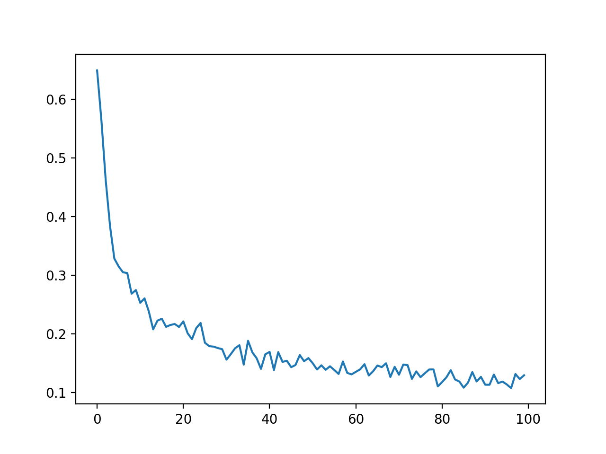
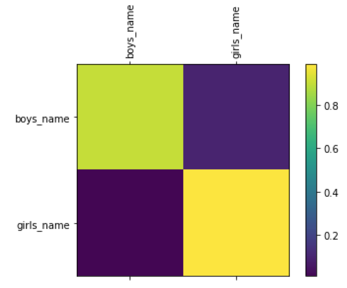

# Japanese Names Gender Classifier


A character based neural network model to classify gender of Japanese names in Katakana.

***Keywords:*** Character based classification, LSTM, PyTorch, Japanese text pre-processing


## Training
### Sample Output

```
0000 30% (0m 46s) 0.0000 ショウタロウ / boys_name ✓  
5000 35% (0m 53s) 0.7279 ヒロ / girls_name ✗ (boys_name)  
0000 40% (1m 1s) 0.0308 メグミ / girls_name ✓  
```
### Loss Curve


### Confusion Matrix



## Prediction
### Sample Output

```
サトシ  
(-0.21) boys_name  
(-1.66) girls_name  
クミコ  
(-0.00) girls_name  
(-10.20) boys_name
...
```
## ToDo
- Collect larger data set including Kanji names
- Derive precision, recall and f1

## Environment
- Python 3.6
- PyTorch 0.3

## Reference

- Classifying Names with a Character-Level RNN
https://pytorch.org/tutorials/intermediate/char_rnn_classification_tutorial.html